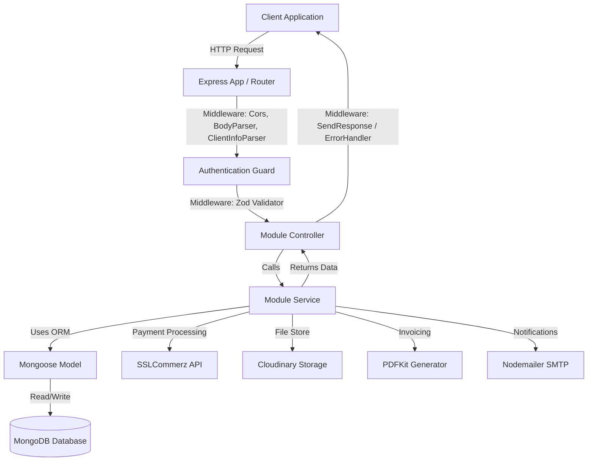

# 🛒 NextMart - High-Performance E-Commerce Backend

[](https://www.typescriptlang.org/)
[](https://nodejs.org/)
[](https://expressjs.com/)
[](https://www.mongodb.com/)
[](https://mongoosejs.com/)
[](https://www.docker.com/)

NextMart Backend is a robust, scalable, enterprise-grade server-side application designed to power single-vendor and multi-vendor e-commerce platforms. Built on top of **Node.js**, **Express.js**, and **MongoDB** using **TypeScript**, this backend incorporates modern architectural patterns, strict type-checking, robust validation, token-based authentication, multi-layered authorization, payment gateway integration, automatic PDF receipt generation, email notification services, and real-time dashboard analytics.

---

## 🏗️ Architecture Design & Design Patterns

NextMart Server adheres to a clean, decoupled **Modular Architecture**. Each domain/feature is encapsulated inside its own module within `src/app/modules/`. This design minimizes side effects, improves maintainability, and simplifies developer scaling.

### Decoupled Layers inside Modules:
1. **Interface (`*.interface.ts`)**: Defines type safety and compile-time data structures using TypeScript interfaces.
2. **Validation Schema (`*.validation.ts`)**: Implements runtime validation using **Zod** to validate incoming HTTP payloads before entering controller logic.
3. **Mongoose Model (`*.model.ts`)**: Formulates the MongoDB database schema, database indexes, and static/instance helper methods.
4. **Service Layer (`*.service.ts`)**: Contains pure business logic, database queries, transactions, and integrations.
5. **Controller Layer (`*.controller.ts`)**: Extracts request queries, body payloads, parameters, and routes them to service layers; manages standard client response templates.
6. **Routes Handler (`*.routes.ts`)**: Establishes API endpoints, registers middleware pipelines (body parsing, authentication, file uploading, validation).



---

## 🛠️ Technology Stack

| Technology / Library | Purpose | Key Details |
|:---|:---|:---|
| **TypeScript** | Strict Typing & Code Safety | Compiles to clean ESM/CommonJS Node modules. |
| **Express.js** | HTTP Web Framework | Fast, unopinionated, minimalist framework for RESTful routing. |
| **MongoDB & Mongoose** | Database & Object Modeling | NoSQL storage utilizing transactional sessions (`startTransaction`). |
| **Zod** | Request Validation | Schema parsing and client error formatting. |
| **JWT (JsonWebToken)** | Token-based Authentication | Uses Access, Refresh, Password Reset, and OTP verification tokens. |
| **Bcrypt** | Password Hashing | Secures user passwords using a 12-round salt work factor. |
| **SSLCommerz (sslcommerz-lts)** | Payment Gateway | Handles payments in BDT with automated IPN (Instant Payment Notification). |
| **Nodemailer** | SMTP Email Client | Integrated with Gmail SMTP to deliver invoices and password reset OTPs. |
| **Handlebars (hbs)** | Dynamic HTML Templating | Powers reusable responsive email templates. |
| **PDFKit** | PDF Generation | Automatically generates invoices with layout, items, and pricing dynamically. |
| **Multer & Cloudinary** | Cloud Storage & File Upload | Facilitates direct-to-cloud profile, logo, and product image uploads. |
| **UAParser.js** | User Agent Auditing | Parses browser, OS, device info for user registration logs. |
| **Docker** | Containerization | Ready-to-deploy Docker images based on `node:20-alpine`. |

---

## ✨ Key Functionalities & Features

### 1. Secure Authentication & Auditing (`auth` & `user` modules)
*   **JWT Implementation**: Double-token architecture (Access token expires in 7 days; Refresh token in 1 year). Cookie-based storage option available.
*   **Security Actions**: Features standard "Change Password", "Forgot Password" (sends a temporary OTP to email), "Verify OTP", and "Reset Password" workflows.
*   **Client Identification Auditing**: Every login/registration tracks IP address, Host name, device type (PC/Mobile), OS, browser, and user-agent through the custom `clientInfoParser` middleware.
*   **User Management**: Administrators can ban, unban, or update the role status of any registered account.

### 2. Multi-Vendor / Merchant Support (`shop` & `product` modules)
*   **Shop Management**: Users with vendor-level status can create and update their shop details (name, description, and logo via Cloudinary integration).
*   **Product Inventory CRUD**: Vendors manage their own inventory. Support for product title, description, category, brand, stock level, pricing, flash-sell discounts, and multi-image galleries (handles array file uploads).
*   **Trending & Feeds**: API dynamically highlights popular products based on customer views and sales metrics.

### 3. Dynamic Brands & Categories (`brand` & `category` modules)
*   **Brand & Category Config**: Controlled endpoints to add logos/icons for categories and brands. Standardizes product tagging.

### 4. Promotion Engine (`coupon` & `flashSell` modules)
*   **Coupon Management**: Vendor-specific or site-wide coupon codes offering flat-rate or percentage discounts. Offers validation endpoints.
*   **Flash Sales**: Schedule flash sales with start and end timestamps. The system computes real-time pricing and tags active flash sale items dynamically.

### 5. Review & Feedback Loop (`review` module)
*   **Product Reviews**: Authenticated customers can write reviews and rate products.

### 6. Order Processing & Transaction Validation (`order` & `sslcommerz` modules)
*   **Checkout Lifecycle**: Places orders, maps line-items to corresponding vendor shops, applies coupon codes, and initializes SSLCommerz payment gateway.
*   **SSLCommerz Gateway Flow**:
    *   Generates validation sessions.
    *   Receives transaction query requests from sandbox/live gateways.
    *   Ensures data integrity during state changes via Mongoose atomic transactions (`startTransaction` / `abortTransaction`).
*   **PDF Invoicing**: When payment is validated successfully, the backend uses `pdfkit` to build a professional payment invoice PDF.
*   **Mail Dispatcher**: The PDF invoice is automatically sent as an attachment to the customer's email using custom Handlebars HTML templates.

### 7. Dashboard Metadata Analytics (`meta` module)
*   **Admin Dashboard**: Aggregates site-wide key performance indicators (KPIs) such as total revenue, total registered shops, order counts, active/inactive vendors, and payment statistics.
*   **Merchant Dashboard**: Retrieves shop-specific statistics (line-charts tracking sales over time, bar-charts representing orders per month, pie-charts showing category revenue shares, and today's sales metrics).

---

## 🚀 Getting Started (Installation Guide)

### Prerequisites
*   Node.js (Version 20 or higher)
*   MongoDB Instance (Local Community Server or MongoDB Atlas cloud cluster)
*   Yarn or NPM package manager

### Installation Steps

1.  **Clone the Repository**:
    ```bash
    git clone https://github.com/Programming-Hero-Next-Level-Development/NextMart-Server.git
    cd NextMart-Server
    ```

2.  **Install Dependencies**:
    ```bash
    yarn install
    # or
    npm install
    ```

3.  **Configure Environment Variables**:
    Create a `.env` file in the root directory and populate it with your credentials:
    ```dotenv
    # Server Execution Environment
    NODE_ENV=development
    PORT=3001
    
    # Database Configuration
    DB_URL="mongodb+srv://<username>:<password>@cluster0.mongodb.net/<db_name>?retryWrites=true&w=majority"
    
    # Security Configurations
    BCRYPT_SALT_ROUNDS=12
    
    # JWT Secrets & Durations
    JWT_ACCESS_SECRET="your_jwt_access_secret_key"
    JWT_ACCESS_EXPIRES_IN=7d
    JWT_REFRESH_SECRET="your_jwt_refresh_secret_key"
    JWT_REFRESH_EXPIRES_IN=1y
    JWT_OTP_SECRET="your_jwt_otp_secret_key"
    JWT_PASS_RESET_SECRET="your_jwt_password_reset_secret_key"
    JWT_PASS_RESET_EXPIRES_IN=15m
    
    # Cloudinary Integration (Image Storage)
    CLOUDINARY_CLOUD_NAME="your_cloudinary_cloud_name"
    CLOUDINARY_API_KEY="your_cloudinary_api_key"
    CLOUDINARY_API_SECRET="your_cloudinary_api_secret"
    
    # Nodemailer SMTP Configuration
    SENDER_EMAIL="your_gmail_address@gmail.com"
    SENDER_APP_PASS="your_gmail_app_password" # Generated via Google Account Settings
    
    # SSLCommerz Payment Integration Details
    STORE_NAME="NextMart Sandbox"
    PAYMENT_API="https://sandbox.sslcommerz.com/gwprocess/v3/api.php"
    VALIDATION_API="https://sandbox.sslcommerz.com/validator/api/validationserverAPI.php"
    STORE_ID="your_sslcommerz_store_id"
    STORE_PASSWORD="your_sslcommerz_store_password"
    VALIDATION_URL="http://localhost:3001/api/v1/ssl/validate"
    SUCCESS_URL="http://localhost:3000/payment/success"
    FAILED_URL="http://localhost:3000/payment/fail"
    CANCEL_URL="http://localhost:3000/payment/cancel"
    ```

4.  **Execute Server in Development Mode**:
    ```bash
    yarn dev
    # or
    npm run dev
    ```
    Once running, the application serves endpoints at `http://localhost:3001`.

---

## 🛠️ CLI Development Tool: Module Generator

To enforce structure consistency and save boilerplate creation time, NextMart Server contains a custom automation script that sets up new workspace modules in a single step.

### Command Execution:
```bash
yarn create-module <module-name>
# or
npm run create-module <module-name>
```

**Example**:
```bash
yarn create-module inventory
```

This automatically generates the following files inside `src/app/modules/inventory/`:
*   `inventory.interface.ts`
*   `inventory.validation.ts`
*   `inventory.model.ts`
*   `inventory.routes.ts`
*   `inventory.controller.ts`
*   `inventory.service.ts`

---

## 📦 Script Scripts Reference

| Command | Action |
|:---|:---|
| `yarn dev` | Runs the server locally with auto-reload transpiled by `ts-node-dev`. |
| `yarn build` | Compiles `.ts` files to plain JavaScript inside the `/dist` directory. |
| `yarn start` | Launches compiled production code from `dist/server.js`. |
| `yarn deploy` | Builds the production bundle and deploys live using the Vercel CLI. |
| `yarn create-module <name>` | Runs the code generation helper script. |

---

## ✈️ Deployment Procedures

### ⚡ Deploying on Vercel
The repository includes a ready-to-run `vercel.json` routing profile. 

1. Ensure the Vercel CLI is installed: `npm i -g vercel`.
2. Configure environmental variables inside the Vercel Web Dashboard.
3. Deploy the application:
   ```bash
   vercel --prod
   ```

### 🐳 Containerization via Docker
A multi-stage standard `Dockerfile` is present in the project root.

1.  **Build the Container Image**:
    ```bash
    docker build -t nextmart-server .
    ```
2.  **Run the Containerized Service**:
    ```bash
    docker run -p 3001:3001 --env-file .env nextmart-server
    ```

---

## 📖 Main API Route Map

All API paths are prefix-bound to `/api/v1`.

| API Endpoint | HTTP Method | Auth Role | Description |
|:---|:---|:---|:---|
| `/auth/login` | `POST` | Public | Logs user in, collects client metadata. |
| `/auth/refresh-token` | `POST` | Public | Renews Access Token. |
| `/auth/forgot-password` | `POST` | Public | Triggers OTP validation mail. |
| `/auth/reset-password` | `POST` | Public | Saves updated password after OTP validation. |
| `/user` | `POST` | Public | Registers customer account. |
| `/user/me` | `GET` | Admin / User | Fetches logged-in profile. |
| `/user/update-profile` | `PATCH` | User | Updates phone, DOB, address, and profile photo. |
| `/shop/my-shop` | `GET` | User (Merchant)| Returns shop metadata and profile. |
| `/shop` | `POST` | User | Registers a new shop (logo upload). |
| `/product` | `POST` | User (Merchant)| Creates a product (supports multi-image upload). |
| `/product` | `GET` | Public | Queries all products (filters, pagination, sorting). |
| `/product/:productId`| `GET` | Public | Returns single product details. |
| `/order` | `POST` | User | Creates an order checkout session. |
| `/order/my-orders` | `GET` | User | Returns list of user's checkout history. |
| `/coupon` | `POST` | User (Merchant)| Sets up a discount coupon code. |
| `/ssl/validate` | `POST`| Public | Validates SSLCommerz transactions, sends emails & PDFs.|
| `/meta` | `GET` | Admin / User | Pulls aggregated analytical metrics. |

### Complete Postman Collection
Find comprehensive path variables, parameters, header schemas, and sample bodies in the official Postman API Documentation:
🔗 **[NextMart API Documentation on Postman](https://documenter.getpostman.com/view/28371413/2sAYQXpCyd)**

---

## 📄 License
This repository is licensed under the **[MIT License](https://opensource.org/licenses/MIT)**. Feel free to use, distribute, and modify.
